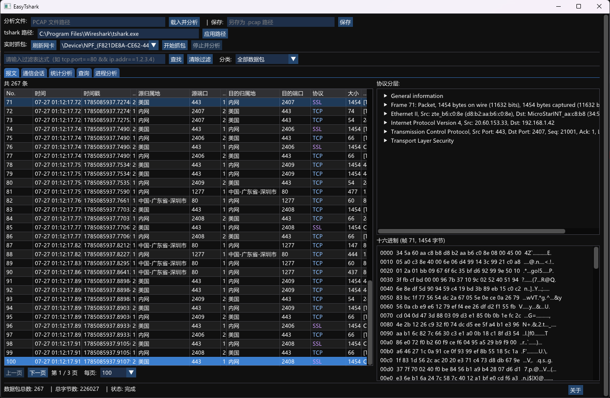

# EasyTshark - 网络数据包捕获与分析工具

本仓库是 EasyTshark 的 **C++ 版本**，从零用 C++11 重写核心抓包与分析逻辑，供学习网络编程、进程管理、SQLite 集成参考。社区正式版由 **“轩辕之风”老师** 维护，见 [easytshark.com](https://www.easytshark.com/)。

EasyTshark 基于 tshark，支持实时抓包与离线 PCAP 分析、SQLite 存储、XML/JSON 格式转换，提供**命令行**与**原生图形界面**两种前端。

> 早期未完成的实现（仅含后端部分，无 GUI）保存在 [`feature/V1`](../../tree/feature/V1) 分支；当前主线是重构后的完整版本。



## 功能特点

- **双模式**：实时抓包（从网卡捕获）/ 离线分析（解析已有 PCAP 文件）
- **双前端**：命令行 `tshark_main`（交互式菜单）/ 图形界面 `tshark_gui`（Dear ImGui，包列表 / 十六进制 / 协议详情树 / 显示过滤）
- **数据存储**：捕获的数据包存入 SQLite，支持快速查询
- **格式转换**：PCAP → tshark PDML(XML) → JSON
- **IP 地理位置**：基于 ip2region 自动解析归属地
- **tshark 自动探测**：依次尝试环境变量 `EASYTSHARK_TSHARK`、平台默认路径、`PATH`、Windows 注册表；也可手动指定（无需重编译）
- **查询**：支持 MAC / IP / 端口 / 归属地模糊匹配，结果可导出 JSON

## 架构

程序以 **`AnalysisSession`（门面）** 为唯一入口，对上服务 CLI / GUI 两种前端，对下装配各职责单一的模块：

| 组件 | 职责 |
|------|------|
| `AnalysisSession` | 门面：装配并协调下列模块 |
| `LiveCapture` | 实时抓包（tshark 子进程 + `EventPoller` 非阻塞读） |
| `PcapAnalyzer` | 离线 PCAP 解析、格式转换调度 |
| `PacketParser` | 将 tshark 的 fields 文本行解析为 `Packet` |
| `PcapFileReader` | 按偏移随机读取 PCAP 原始字节（POSIX `mmap` / `ifstream` 回退） |
| `PdmlToJsonConverter` | PDML(XML) → JSON |
| `FlowMonitor` | 各网卡流量趋势监控 |
| `TsharkCommand` | tshark 路径解析、命令参数构造、网卡枚举 |
| `SQLiteUtil` / `IP2RegionUtil` | 数据入库与查询 / IP 归属地解析 |
| `ProcessUtil` / `EventPoller` | 子进程创建回收 / I/O 多路复用抽象 |

安全要点：子进程调用统一走 `ProcessUtil::PopenEx` 的参数向量方式（`execvp`，不经 `/bin/sh`），避免 shell 注入；SQL 查询统一走 `sqlite3_bind_*` 参数化绑定，避免 SQL 注入。

## 系统要求

- **平台**：macOS（已验证）、Windows（MSVC，已支持）、Linux（与 macOS 共用 `poll` 实现，理论支持，待验证）
- tshark（Wireshark 命令行工具）、SQLite3、C++11 编译器
- CMake 3.10+（若用 CMake 4.x 需加 `-DCMAKE_POLICY_VERSION_MINIMUM=3.5`，脚本已内置）

## 依赖库

以下库以 vendored 源码形式随仓库提供（`third_party/`），首次 clone 后即可离线构建：sqlite3、loguru、rapidjson、rapidxml、ip2region、Dear ImGui + GLFW（GUI 依赖，未就位时 CMake 会自动跳过 `tshark_gui` 目标）。

## 安装与构建

**1. 安装依赖**

```bash
# macOS
brew install --cask wireshark && brew install cmake

# Linux (Debian/Ubuntu，命令待再次验证)
sudo apt-get install -y build-essential cmake tshark libsqlite3-dev

# Windows：安装 Wireshark（提供 tshark.exe）与 VS 2022 Build Tools（C++ 工作负载）
```

**2. 克隆并构建**

```bash
git clone git@github.com:hhhweihan/EasyTshark.git
cd EasyTshark
./scripts/build_unix.sh          # 默认清理构建、编译、运行测试；--help 查看更多选项
```

Windows 下在普通 `cmd`（非 Git Bash）中运行 `scripts\build_windows.bat`。

构建产物输出到 `output/`：`tshark_main`（CLI）、`tshark_gui`（GUI，依赖就位时）、`unit_tests`。

## 使用方法

```bash
./output/tshark_main   # 命令行版：按提示选择实时抓包/离线分析，解析入库后可选查询
./output/tshark_gui    # 图形界面版：打开 PCAP 或启动抓包，浏览包列表/十六进制/协议树，支持显示过滤
```

输出文件位于 `data/`：`pcaps/capture_<时间戳>.pcap`（抓包）、`pcaps/packets_<时间戳>.db`（SQLite）、`packets.xml`（PDML）、`packets.json`。`data/` 与 `logs/` 为运行时生成目录，已 gitignore。

## 单元测试

基于 Google Test（构建时自动拉取），覆盖解析、抓包、数据库、格式转换、错误处理、IP 归属地、进程管理等场景；缺少 tshark 或测试数据的用例会自动 SKIP。

```bash
./output/unit_tests                                          # 全部测试
./output/unit_tests --gtest_filter=TsharkToolsTest.*          # 指定套件
./output/unit_tests --gtest_output=xml:test_report.xml        # 生成报告
```

## 项目结构

```
.
├── CMakeLists.txt
├── scripts/build_unix.sh / build_windows.bat
├── include/            # 第一方头文件
├── src/                # 第一方源文件（main.cpp / gui/main_gui.cpp 为两个入口）
├── third_party/        # vendored 第三方库
├── tests/              # 单元测试
├── resources/          # 运行所需资源（ip2region.xdb）
└── output/             # 构建产物（gitignore）
```

## 许可证

[](https://opensource.org/licenses/MIT)

MIT 许可证，允许自由使用、修改和分发，需保留原始版权声明。完整条款见 [LICENSE](./LICENSE)。
