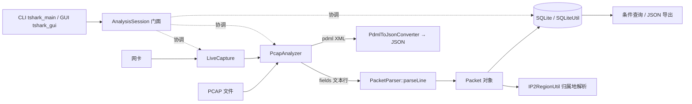

# EasyTshark - 网络数据包捕获与分析工具

本仓库是 EasyTshark 的 **C++ 学习版本**，从零用 C++11 重写核心抓包与分析逻辑，供学习网络编程、进程管理、SQLite 集成参考。社区成品版由原作者维护，见 [easytshark.com](https://www.easytshark.com/)。

EasyTshark 是一个基于 tshark 的网络数据包分析工具，提供实时抓包和离线分析功能，支持数据包的 SQLite 存储和 XML/JSON 格式转换，并提供**命令行**与**原生图形界面**两种前端。

## 功能特点

- **双模式操作**：
  - 实时抓包模式：直接从网络接口捕获数据包
  - 离线分析模式：分析已有的 PCAP 文件

- **两种前端**：
  - 命令行版（`tshark_main`）：交互式菜单
  - 图形界面版（`tshark_gui`）：基于 Dear ImGui 的原生界面，包列表 / 十六进制 / 协议详情树 / 显示过滤

- **数据存储**：
  - 将捕获的数据包存储到 SQLite 数据库
  - 支持数据包的快速查询和检索

- **格式转换**：
  - 将 PCAP 经 tshark 导出为 PDML(XML)
  - 再将 PDML 转换为 JSON，便于前端展示

- **IP 地理位置**：
  - 基于 ip2region 自动解析数据包中 IP 地址的归属地

- **tshark 自动探测**：
  - 启动时自动定位 tshark：环境变量 `EASYTSHARK_TSHARK`、`PATH`、Windows 注册表与常见安装目录
  - 也可通过上述环境变量或 GUI 输入框手动指定路径（无需重新编译）；未找到时给出 Wireshark 下载引导

### 查询功能
- 支持 MAC 地址、IP 地址、端口、归属地四类条件查询（均支持模糊匹配）
- 支持将查询结果保存为 JSON 文件

## 架构说明

程序以 **`AnalysisSession`（门面）** 为唯一入口，对上服务 CLI / GUI 两种前端，对下装配并协调各职责单一的模块：`LiveCapture` 负责实时抓包、`PcapAnalyzer` 负责离线解析、`PacketParser` 把 tshark 的 fields 文本行解析成 `Packet`、`PcapFileReader` 按偏移随机读原始字节、`PdmlToJsonConverter` 做 PDML→JSON、`FlowMonitor` 做网卡流量趋势监控；`tsharkCommand` 收敛底层 tshark 交互（路径解析 / 参数构造 / 网卡枚举），`utils` 提供数据库、IP 归属地、编码等通用能力，`ProcessUtil` 封装子进程的创建与回收，`EventPoller` 抽象 I/O 多路复用（POSIX 用 `poll`，Windows 用 `PeekNamedPipe` 轮询）。整体数据流如下：



- **子进程调用**：所有 tshark 调用均通过 `ProcessUtil::PopenEx(argv, ...)` 以参数向量方式执行（`execvp`），不经过 `/bin/sh`，避免 shell 注入；调用结束后回收子进程，防止僵尸进程。
- **实时抓包**：`LiveCapture` 启动 tshark 子进程写文件，抓包结束后交由 `PcapAnalyzer` 解析入库。
- **离线分析**：`PcapAnalyzer` 逐行解析 tshark 的 fields 输出并记录报文在文件中的偏移，`PcapFileReader` 据此按偏移精确读取原始字节（POSIX 下用 `mmap`，其它平台回退 `std::ifstream`）。
- **查询**：`SQLiteUtil::buildFuzzyQuery` 生成带 `?` 占位符的参数化 SQL，`queryPackets` 用 `sqlite3_bind_*` 绑定用户输入，避免 SQL 注入。

### 核心组件

| 组件 | 职责 |
|------|------|
| `AnalysisSession` | 门面：装配并协调下列模块，是 CLI / GUI 前端的唯一入口 |
| `PacketParser` | 将 tshark 的 fields 文本行解析为 `Packet` 对象 |
| `PcapAnalyzer` | 离线 PCAP 解析、按偏移读原始字节、格式转换调度 |
| `LiveCapture` | 实时抓包（tshark 子进程 + `EventPoller` 非阻塞读） |
| `FlowMonitor` | 各网卡流量趋势监控（`EventPoller` 多路复用） |
| `PcapFileReader` | 按偏移随机读取 PCAP 原始字节（POSIX `mmap` / `ifstream` 回退） |
| `PdmlToJsonConverter` | 将 tshark 的 PDML(XML) 转换为 JSON |
| `TsharkCommand` | tshark 路径解析（自动探测 / 环境变量 / 手动指定）、命令参数构造、网卡枚举 |
| `SQLiteUtil` | 数据包入库、参数化查询、结果导出 JSON |
| `IP2RegionUtil` | 根据 IP 解析地理位置（xdb 用 `call_once` 仅初始化一次） |
| `CommonUtil` | 时间戳、字段名翻译等通用工具 |
| `ProcessUtil` | 安全地创建、等待、终止 tshark 子进程 |
| `EventPoller` | I/O 多路复用抽象（POSIX `poll` / Windows `PeekNamedPipe` 轮询） |

## 系统要求

- **操作系统**（所有平台差异均以 `#if defined(_WIN32)` / `#else` 隔离，POSIX 路径行为不变）：
  - **macOS**：已支持并验证（抓包 / 监控经 `EventPoller` 的 `poll` 实现，tshark 由 Wireshark.app 提供）。
  - **Windows**：已支持（MSVC 原生编译；进程与管道走 `CreateProcessA` / `CreatePipe`，多路复用走 `PeekNamedPipe` 轮询，tshark 路径自动探测含注册表）。构建步骤见下方「编译项目」。
  - **Linux**：与 macOS 共用可移植的 `poll` 实现，理论支持，**尚待再次实测验证**。
- tshark（Wireshark 命令行工具）
- SQLite3
- C++11 兼容的编译器
- CMake **3.10+**；若使用 **CMake 4.x**，构建时需附加 `-DCMAKE_POLICY_VERSION_MINIMUM=3.5`（见下方「编译」说明；`run.sh` 已内置该参数）

## 依赖库

以下库均以 vendored 源码形式随仓库提供（放在 `third_party/<名字>/`），首次 clone 后即可离线构建：

- **sqlite3**：数据存储（macOS / Linux 使用系统库）
- **loguru**：日志记录（`third_party/loguru/`）
- **rapidjson**：JSON 处理
- **rapidxml**：XML 处理
- **ip2region**：IP 地理位置解析
- **Dear ImGui + GLFW + OpenGL3**：图形界面（`third_party/imgui/`、`third_party/glfw/`；若这两个目录未就位，CMake 会自动跳过 `tshark_gui` 目标，CLI 与测试仍可独立构建）

## 安装

### 1. 安装依赖

**macOS（Homebrew）**：

```bash
brew install --cask wireshark   # 提供 tshark（位于 /Applications/Wireshark.app）
brew install cmake              # 若尚未安装
# sqlite3 / iconv 为 macOS 系统自带，无需单独安装
```

**Linux（Debian/Ubuntu，命令待再次验证）**：

```bash
sudo apt-get update
sudo apt-get install -y build-essential cmake tshark libsqlite3-dev
```

**Windows（MSVC）**：安装 [Wireshark](https://www.wireshark.org/)（提供 `tshark.exe`）与
VS 2022 Build Tools（含 C++ 工作负载，自带 CMake / Ninja）。sqlite3 已 vendored，无需另装。

### 2. 克隆仓库

```bash
git clone git@github.com:hhhweihan/EasyTshark.git
cd EasyTshark
```

### 3. 编译项目

**脚本构建（推荐）**：

```bash
# 默认构建（清理构建目录，编译项目，运行测试并忽略测试失败）
./run.sh

# 不清理构建目录
./run.sh --no-clean

# 不运行测试
./run.sh --no-test

# 严格测试模式（测试失败时退出）
./run.sh --strict-test

# 运行特定测试
./run.sh --test=TsharkToolsTest.ConvertXmlToJson

# 查看帮助信息
./run.sh --help
```

**手动构建**：

```bash
# CMake 4.x 需加 -DCMAKE_POLICY_VERSION_MINIMUM=3.5，
# 因 vendored 的 GLFW / googletest 声明的最低 CMake 版本低于 3.5；
# CMake 3.10~3.x 会忽略该变量，加上无副作用。
cmake -S . -B build -DCMAKE_POLICY_VERSION_MINIMUM=3.5
cmake --build build
```

构建产物输出到 `output/` 目录：`tshark_main`（CLI）、`tshark_gui`（GUI，依赖就位时）、`unit_tests`（测试）。

**Windows（MSVC）**：在普通 `cmd` 中运行 `scripts\build_windows.bat`（勿用 Git Bash），
产物为 `output\tshark_main.exe` / `output\tshark_gui.exe`。

## 使用方法

### 命令行版

```bash
./output/tshark_main
```

操作流程：

1. 选择模式：输入 `1`（实时抓包）或 `2`（离线分析）。
2. 实时抓包模式：查看网卡列表 → 输入要监控的网卡名称 → 输入抓包时间（秒）→ 等待抓包与解析完成。
3. 离线分析模式：输入 PCAP 文件路径（若检测到已有抓包文件，可选择复用）。
4. 数据处理自动进行：解析入库 SQLite，并导出 `data/packets.xml`（PDML）与 `data/packets.json`。
5. 可选查询：按提示输入 `y` 进入查询，支持 MAC / IP / 端口 / 归属地条件，结果可保存为 JSON。

### 图形界面版

```bash
./output/tshark_gui
```

在界面中打开 PCAP / 启动抓包，浏览包列表、十六进制、协议详情树，并使用显示过滤。

### 输出文件

| 路径 | 说明 |
|------|------|
| `data/pcaps/capture_<时间戳>.pcap` | 抓包生成的 PCAP 文件 |
| `data/pcaps/packets_<时间戳>.db` | SQLite 数据库文件 |
| `data/packets.xml` | PDML(XML) 格式的数据包信息 |
| `data/packets.json` | JSON 格式的数据包信息 |

> 说明：`data/` 与 `logs/` 为运行时生成目录，已加入 `.gitignore`，不纳入版本控制。

## 单元测试

项目使用 Google Test 框架进行单元测试（googletest 由 CMake 在构建时自动拉取），覆盖核心功能与边缘情况。

### 测试套件

| 套件 | 覆盖内容 |
|------|----------|
| `TsharkToolsTest` | 构造、网卡列表获取、XML/JSON 转换等基础能力 |
| `PacketParserTest` | fields 文本行解析为 `Packet`（含异常输入兜底） |
| `OfflineAnalysisTest` | 离线分析流程、流式与累积一致性、文件转换 |
| `SQLiteUtilTest` | 数据库创建、数据包插入、查询 |
| `DataConversionTest` | PCAP→XML、XML→JSON、节点转换 |
| `ErrorHandlingTest` | 无效文件 / 格式错误 / 权限问题处理 |
| `IP2RegionUtilTest` | 公网 / 内网 / 无效 IP 归属地解析 |
| `CommonUtilTest` | 时间戳生成、字符串处理 |
| `ProcessUtilTest` | 进程执行、管道通信、进程终止 |
| `PerformanceTest` | 关键路径性能基准 |
| `IntegrationTest` | 完整离线分析工作流 |

> 部分依赖 tshark 或测试数据的用例，在环境缺失时会自动 **SKIP**，不计为失败。

### 运行测试

```bash
# 运行所有测试
./output/unit_tests

# 运行特定测试套件
./output/unit_tests --gtest_filter=TsharkToolsTest.*

# 运行特定测试
./output/unit_tests --gtest_filter=TsharkToolsTest.ConvertXmlToJson

# 生成 XML 格式的测试报告
./output/unit_tests --gtest_output=xml:test_report.xml
```

## 项目结构

```
.
├── CMakeLists.txt              # CMake 构建配置
├── run.sh                      # 构建和测试脚本
├── .clang-format               # 代码格式化规范
├── LICENSE                     # MIT 许可证
├── include/                    # 第一方头文件（仅项目自身）
│   ├── AnalysisSession.hpp     # 门面
│   ├── PacketParser.hpp        # fields 行解析
│   ├── PcapAnalyzer.hpp        # 离线分析
│   ├── LiveCapture.hpp         # 实时抓包
│   ├── FlowMonitor.hpp         # 网卡流量监控
│   ├── PcapFileReader.hpp      # 按偏移读原始字节
│   ├── PdmlToJsonConverter.hpp # PDML→JSON
│   ├── tsharkCommand.hpp       # tshark 交互（路径/参数/网卡枚举）
│   ├── tsharkDataType.hpp      # 数据类型定义
│   ├── processUtil.hpp         # 子进程操作工具
│   ├── utils.hpp               # SQLite / IP 归属地 / 通用工具
│   └── platform/EventPoller.hpp# I/O 多路复用抽象
├── third_party/                # vendored 第三方库（与第一方代码物理隔离）
│   ├── loguru/                 # 日志
│   ├── imgui/ glfw/            # 图形界面（Dear ImGui + GLFW）
│   ├── rapidjson/ rapidxml/    # JSON / XML 处理
│   ├── ip2region/              # IP 地理位置解析
│   └── sqlite3/                # SQLite amalgamation（Windows 内置编译）
├── src/                        # 源文件目录
│   ├── main.cpp                # CLI 主程序入口
│   ├── AnalysisSession.cpp
│   ├── PacketParser.cpp
│   ├── PcapAnalyzer.cpp
│   ├── PcapFileReader.cpp
│   ├── LiveCapture.cpp
│   ├── FlowMonitor.cpp
│   ├── PdmlToJsonConverter.cpp
│   ├── tsharkCommand.cpp
│   ├── processUtil.cpp
│   ├── utils.cpp
│   ├── xdb_search.cc / xdb_bench.cc  # ip2region 实现
│   ├── platform/EventPollerPoll.cpp  # poll 实现
│   └── gui/main_gui.cpp        # GUI 主程序入口
├── tests/                      # 单元测试目录
│   ├── CMakeLists.txt
│   ├── test_tsharkManager.cpp  # TsharkToolsTest
│   ├── test_packet_parser.cpp
│   ├── test_offline_analysis.cpp
│   ├── test_data_conversion.cpp
│   ├── test_error_handling.cpp
│   ├── test_performance.cpp
│   └── test_utils.cpp
├── resources/                  # 运行所需资源（构建时拷到 output/）
│   └── ip2region.xdb
└── output/                     # 构建产物（tshark_main / tshark_gui / unit_tests，已 gitignore）
```

## 许可证

[](https://opensource.org/licenses/MIT)

本项目采用 MIT 开源许可证，允许自由使用、修改和分发代码。使用本项目的代码时需满足：
- 在副本中保留原始版权声明
- 不得使用项目作者的名义进行背书

完整条款请参见 [LICENSE 文件](./LICENSE)。
